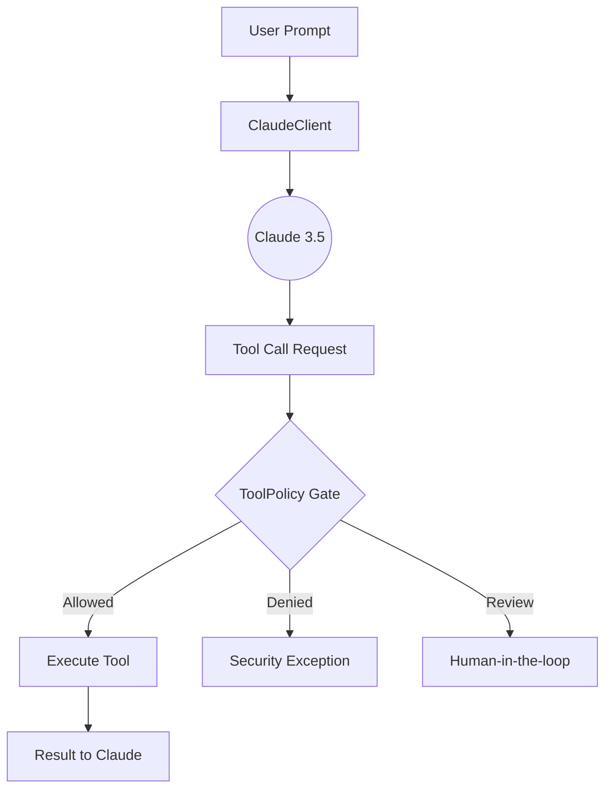

# 🤖 Claude Agent Core

[](https://github.com/Informant254/claude-agent-core/stargazers)
[](https://opensource.org/licenses/MIT)
[](https://www.python.org/downloads/)
[](https://www.anthropic.com/claude)
[](https://github.com/Informant254/claude-agent-core)

**High-performance, lightweight Python primitives for building Claude-powered agents with explicit input validation and zero-trust tool policy gates.**

---

## 🌟 Why Claude Agent Core?

While large frameworks like LangChain or CrewAI offer extensive features, they often come with significant overhead and "black-box" safety decisions. **Claude Agent Core** is built for developers who demand:

- **Absolute Control**: Explicitly gate every tool call before it hits your production environment.
- **Claude Optimization**: Specifically tuned for Claude 3.5 Sonnet's unique prompt structures and tool-calling capabilities.
- **Zero Dependencies**: A thin, readable foundation that won't bloat your project.
- **Security-First**: Built-in validation for prompts, token counts, and tool arguments.

---

## 🏗️ Architecture: The Policy Gate

Claude Agent Core introduces a **Policy Layer** that sits between the LLM and your external tools. This ensures that even if an LLM is "hallucinating" or being manipulated, your system remains secure.



---

## 🛠️ Quick Start

### Installation

```bash
pip install git+https://github.com/Informant254/claude-agent-core.git
```

### Basic Usage

```python
from claude_agent_core.client import ClaudeClient

# Initialize the client (looks for ANTHROPIC_API_KEY in env)
client = ClaudeClient()

response = client.generate_response("Draft a security policy for a small startup.")
print(response)
```

### Implementing a Zero-Trust Tool Policy

```python
from claude_agent_core.policy import ToolPolicy

# Define your safety boundaries
policy = ToolPolicy(
    allowed_tools={"search_web", "read_file"},
    confirmation_required={"delete_file", "send_email"},
    max_argument_bytes=1024, # Prevent prompt injection via massive arguments
)

# Evaluate a tool call before execution
decision = policy.evaluate("delete_file", {"path": "config.json"})

if decision.allowed and decision.requires_confirmation:
    print("⚠️ Action requires human approval!")
```

---

## 📊 Comparison

| Feature | Claude Agent Core | LangChain | CrewAI |
| :--- | :--- | :--- | :--- |
| **Complexity** | Extremely Low | High | Medium |
| **Learning Curve** | 5 Minutes | Weeks | Days |
| **Security Gates** | Native & Explicit | Middleware/Custom | Custom |
| **Claude Optimization** | Primary Focus | General | General |
| **Dependencies** | Minimal | Heavy | Heavy |

---

## 🤝 Contributing & Support

We are building the most secure foundation for AI agents. If you believe in a safer AI future:

1.  **Give us a ⭐ Star** – It helps more developers find this project.
2.  **Fork & Contribute** – Check out our [Good First Issues](https://github.com/Informant254/claude-agent-core/issues).
3.  **Share** – Let others know about a lightweight alternative for Claude agents.

Built with ❤️ by [Informant254](https://github.com/Informant254)
